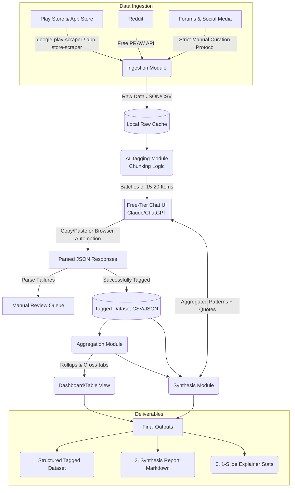

# Architecture: Blinkit Category Discovery Feedback Engine

## 1. System Overview
The Blinkit Feedback Engine is a **single-batch, zero-cost data pipeline**. It extracts raw, unstructured feedback from public sources, standardizes it, and uses a free-tier Large Language Model (LLM) chat interface to structure and tag the data according to a predefined behavioral schema. It then aggregates the findings and synthesizes a comprehensive final report.

This pipeline intentionally avoids paid API tiers (like the Twitter API or programmatic LLM APIs). It relies on open-source scrapers, strict manual curation, and a semi-manual or browser-automated interaction loop with free LLM UIs (e.g., Claude.ai or ChatGPT).

---

## 2. High-Level Data Flow

---

## 3. Core System Modules

### 3.1. Ingestion Module (FR1)
Responsible for fetching unstructured text data from external platforms at zero API cost.
*   **Tools**: Python (`google-play-scraper`, `app-store-scraper`, `praw` for Reddit).
*   **Manual Curation**: Uses a fixed protocol (pre-defined keywords, date ranges, fixed pull counts, and inclusion of neutral/contradicting posts) to pull from X/Twitter, Instagram, Facebook groups, and product reviews.
*   **Operations**: Normalizes data into a base schema (`id`, `source`, `app_name`, `date`, `raw_text`), deduplicates, and filters out non-English/Hinglish content.
*   **Resiliency**: Caches raw data locally to allow for resumability and to respect Reddit's rate limits.

### 3.2. AI Tagging Module (FR2)
The core processing engine that transforms unstructured text into structured data, constrained by the lack of API access.
*   **Mechanism**: Reads the local cache and chunks data into small batches (e.g., 15-20 items) that fit comfortably within a chat context window. 
*   **Execution**: A semi-manual pipeline. The chunked batches are pasted into a free-tier LLM UI alongside a strict tagging prompt. The structured JSON output is captured and appended to the dataset. *(Note: This can be semi-automated if the Antigravity agent can drive the browser UI).*
*   **Schema Enforcement**: Validates output against fields like `category_mentioned`, `trigger_type`, `friction_type`, and `segment_signal`. Items that fail validation are queued for manual review.

### 3.3. Aggregation Module (FR3)
The statistical and computational layer.
*   **Operations**: Computes frequency distributions and cross-tabulations (e.g., `friction_type` x `segment_signal`) from the Tagged Dataset.
*   **Output**: Produces queryable views and summary statistics that feed both the Dashboard and the Synthesis Module.

### 3.4. Synthesis Module (FR4)
The narrative generation engine.
*   **Mechanism**: Takes the aggregated rollups and a sample of PII-stripped `evidence_quote`s.
*   **Execution**: Feeds these aggregated findings into the same free-tier chat interface to generate a final markdown report that explicitly answers the 8 core research questions.

---

## 4. Key Architectural Constraints & Requirements

*   **Zero-Cost Execution**: No paid endpoints are permitted. The entire pipeline relies on open-source tools, manual curation, and free-tier LLM interfaces.
*   **PII Stripping**: All personally identifying details must be stripped from `evidence_quote`s before synthesis or presentation.
*   **Language Filtering**: The v1 scope is English-only. Non-English items must be explicitly flagged, excluded, and counted for the final coverage report.
*   **Anti-Cherry-Picking Protocol**: Manual data collection must strictly adhere to the predefined sourcing protocol. Search queries used during this process must be logged alongside the dataset for auditability.
*   **Traceability**: Every claim made in the final markdown synthesis report must be traceable back to the specific row(s) in the Tagged Dataset.
